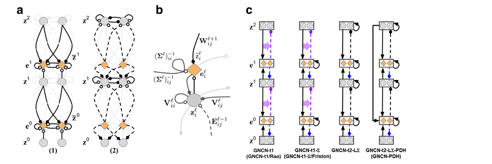
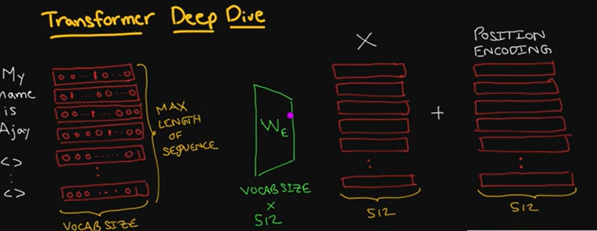
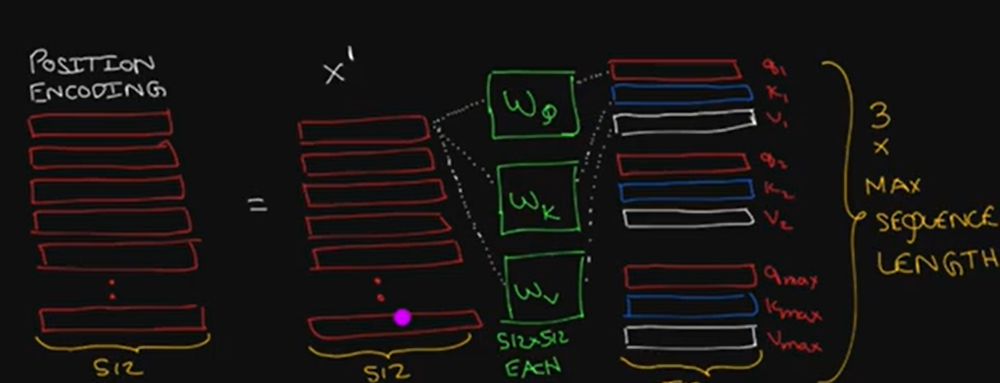
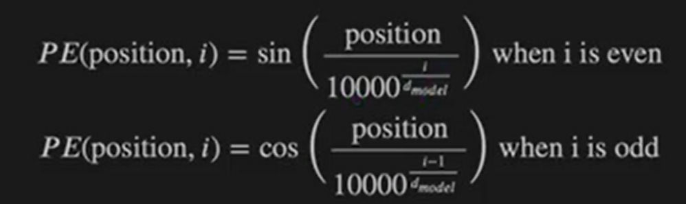
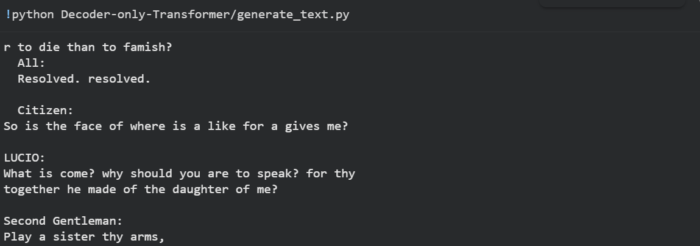

# THE CORE WISDOM I GET FROM DECODER ONLY TRANSFORMER
    1 Attention is a communication mechanism. Can be seen as nodes in a directed graph looking at each other
    and aggregating information with a weighted sum from all nodes that point to them, with data-dependent weights.
    2 There is no notion of space. Attention simply acts over a set of vectors. 
    This is why we need to positionally encode tokens.
    3 Each example across batch dimension is of course processed completely independently 
    and never "talk" to each other
    4 In an "encoder" attention block just delete the single line that does masking with tril, allowing all tokens to communicate. 
    This block here is called a "decoder" attention block because it has triangular masking, 
    and is usually used in autoregressive settings, like language modeling.
    5 "self-attention" just means that the keys and values are produced from the same source as queries. 
    In "cross-attention", the queries still get produced from x, but the keys and values come from some other, 
    external source (e.g. an encoder module)
    6 "Scaled" attention additional divides wei by 1/sqrt(head_size). 
    This makes it so when input Q,K are unit variance, wei will be unit variance too and Softmax will stay diffuse 
    and not saturate too much. Illustration below

# 🤖 FastAPI Mini-GPT Transformer

[](https://github.com/<YOUR_USERNAME>/<YOUR_REPO>/actions/workflows/main.yml)

This project is a simple, character-level, decoder-only Transformer model (a "mini-GPT") built from scratch using PyTorch. The model is trained to predict the next character in a sequence.

The entire application is wrapped in a **FastAPI** web service, providing API endpoints to:
* Generate new text from a prompt.
* Evaluate the model's performance (loss and perplexity) on a dataset.

The repository includes a complete CI/CD pipeline using **GitHub Actions** to automatically build, test, and deploy the application to **Render**.

---

## 📂 Project Structure

Here is an overview of the key files in this project:
. ├── Data/ │ ├── train.csv │ ├── validation.csv │ └── test.csv ├── assets/ │ ├── loss_data.json (Generated by training) │ └── loss_plot.png (Generated by training) ├── .github/workflows/ │ └── main.yml # CI/CD pipeline definition ├── decoder.py # Core Transformer model (GPTLanguageModel) and training logic ├── eval.py # Script to evaluate the trained model (prints loss/perplexity) ├── generate_text.py # Function to generate text using the trained model ├── visualize.py # Utility to plot and save training/validation loss metrics ├── app.py # FastAPI application to serve the model ├── Dockerfile # Docker configuration for containerizing the app ├── requirements.txt # Python dependencies └── decoder.pth (Generated by training)


---












## 🚀 Getting Started (Local Setup)

Follow these steps to set up and run the project on your local machine using a virtual environment.

### 1. Prerequisites

* Python 3.9+
* `pip` and `venv`

### 2. Installation & Setup

1.  **Clone the repository:**
    ```bash
    git clone [https://github.com/](https://github.com/)<YOUR_USERNAME>/<YOUR_REPO>.git
    cd <YOUR_REPO>
    ```

2.  **Create and activate a virtual environment:**
    * **macOS / Linux:**
        ```bash
        python3 -m venv venv
        source venv/bin/activate
        ```
    * **Windows:**
        ```bash
        python -m venv venv
        .\venv\Scripts\activate
        ```

3.  **Install dependencies:**
    You will need a `requirements.txt` file. Based on the project, it should contain:
    ```txt
    # requirements.txt
    torch
    matplotlib
    fastapi
    uvicorn[standard]
    pytest
    ```
    Install them with:
    ```bash
    pip install -r requirements.txt
    ```

---

## 🏃‍♂️ How to Run

### 1. Train the Model

The first step is to train the model. This script will run the training loop and, upon completion, save the trained model weights as `decoder.pth`. It will also generate training graphs in the `assets/` directory.

```bash
python decoder.py 
```
Output:

Model device: cuda
10.880897 M parameters
Epoch 1: avg train loss = 2.4567
Epoch 1: avg val loss = 2.3890
...
Epoch 15: avg train loss = 1.8921
Epoch 15: avg val loss = 1.9543
✅ Plot saved: assets/loss_plot.png
✅ Data saved: assets/loss_data.json

✅ Training complete! Model saved as 'decoder.pth'.

2. Evaluate the Model
Once you have a decoder.pth file, you can evaluate its performance (loss and perplexity) on the test set.

Bash
``` bash
python eval.py 
```
Output:

TEST | Avg Loss: 1.9482 | Perplexity: 7.0163
3. Run the API Server
To interact with the model via an API, run the FastAPI application using uvicorn.

Bash

uvicorn app:app --reload --port 8000
The server will be live at http://127.0.0.1:8000. You can access the auto-generated documentation at http://127.0.0.1:8000/docs.


Docker Usage
You can also build and run the entire application as a Docker container.

Build the Docker image: (Ensure you have a trained decoder.pth model file first)

Bash

docker build -t mini-gpt-api .
Run the Docker container: This command maps your local port 8000 to the container's port 8000.

Bash

docker run -p 8000:8000 -e PORT=8000 mini-gpt-api
The API will be accessible at http://localhost:8000.

📡 API Endpoints
The FastAPI server provides two main endpoints. You can test them using curl, Postman, or the built-in docs at http://localhost:8000/docs.

POST /generate_text
Generates new text based on a given prompt.

Request Body:

JSON

{
  "prompt": "First Citizen:
Before we proceed any further, hear me speak.

All:
Speak, speak.

First Citizen:
You are all resolved rather to die than to famish?

All:
Resolved. resolved.

First Citizen:
First, you know Caius Marcius is chief enemy to the people.

All:
We know't, we know't.

First Citizen:
Let us kill him, and we'll have corn at our own price.
Is't a verdict?

All:
No more talking on't; let it be done: away, away!

Second Citizen:
One word, good citizens.",
  "temperature": 0.7,
 
}
Example curl:

Bash

curl -X POST "[http://127.0.0.1:8000/generate_text](http://127.0.0.1:8000/generate_text)" \
     -H "Content-Type: application/json" \
     -d '{"prompt": "First Citizen:
Before we proceed any further, hear me speak.

All:
Speak, speak.

First Citizen:
You are all resolved rather to die than to famish?

All:
Resolved. resolved.

First Citizen:
First, you know Caius Marcius is chief enemy to the people.

All:
We know't, we know't.

First Citizen:
Let us kill him, and we'll have corn at our own price.
Is't a verdict?

All:
No more talking on't; let it be done: away, away!

Second Citizen:
One word, good citizens."}'
Response:

JSON

{
  "generated_text": "r to die than to famish?
  All:
  Resolved. resolved.

  Citizen:
So is the face of where is a like for a gives me?

LUCIO:
What is come? why should you are to speak? for thy
together he made of the daughter of me?

Second Gentleman:
Play a sister thy arms,"
}